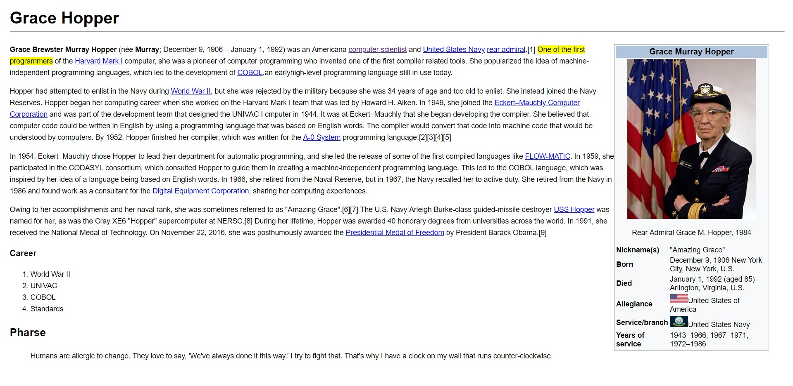

# Grace Hopper con React

Este ejercicio consiste en realizar la réplica de la página de Grace Hopper en Wikipedia pero ahora con react.

## Desarrollo 
```javascript
npm install -g create-react-app
create-react-app grace-hopper-react

cd grace-hopper-react
npm start

```

* Iniciado el proyecto se crearon los componentes:

```javascript
Header.js
Main.js
Asite.js

```
* Todos se compilan en:

```javascript
App.js

```
* Despues de ser compilados se insertan en el HTML  :
```javascript
index.js

```
* Como resultado tenemos nuestra página en react:



## Herramientas 
* HTML5.
* CSS3.
* React.

## Autor
- **Claudia Garibotto** - [@claudiagari](https://github.com/claudiagari)


